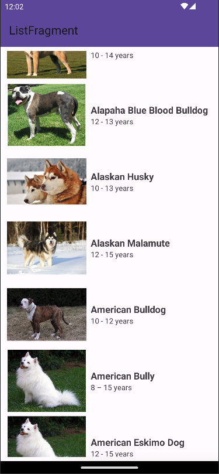
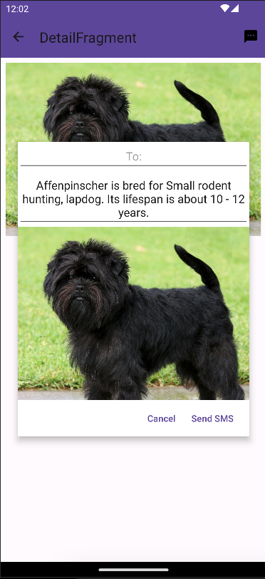
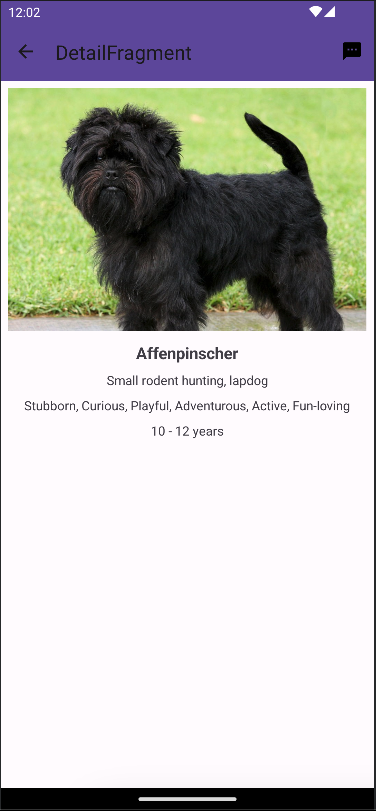

# DogsBrowser
An app that allows users to browse dog breeds loaded from remote API and cached in the local Room database. Made with Android Jetpack and Views.

# About the app
The application is based on data downloaded from remote API with Retrofit. In case of poor Internet connection or no connection at all data from the API is cached in the local Room database.
Users can browse dog breed details and send them via SMS.

  

  

  

# Technology & Techniques
Used technology and programming techniques
* Android SDK
* Android Views
* Kotlin
* Coroutines
* MVVM pattern
* Dependency Injection with Hilt
* Retrofit
* Coil (for image loading)
* Permissions
* Kotlin flows
* Room database
* SMS Manager

  # Credits
  [API](https://raw.githubusercontent.com/DevTides/DogsApi/master/dogs.json) used in this app.
